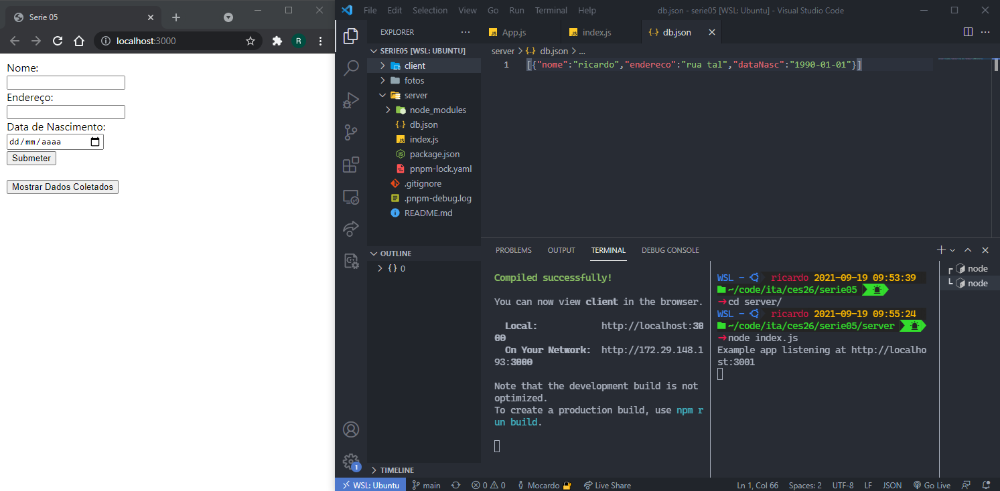
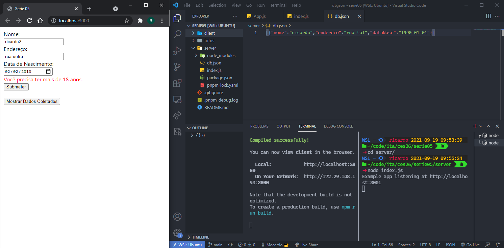
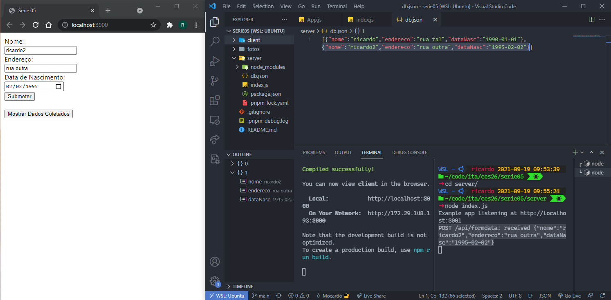
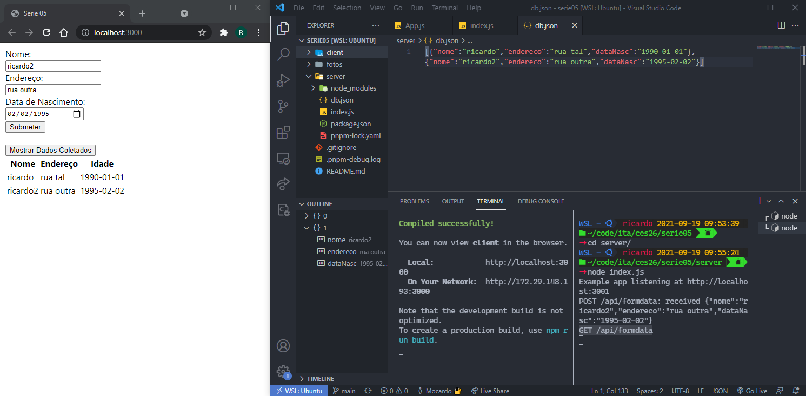

# ces26serie05 - Relatório
### Aluno: Ricardo Macedo Pacheco

___

Figura 1: Momento logo após a inicialização dos servidores de desenvolvimento do react (porta 3000) e do backend em node (porta 3001).

À esquerda vemos o navegador contendo o formulário pedido.

À direita há a janela do vscode com um arquivo e dois terminais.

O arquivo mostra o estado atual da database em json (db.json), que contém uma entrada apenas proveniente de um teste anterior.

Os terminais mostram o output do servidor react, na esquerda, e do servidor backend, na direita.
___

Figura 2: Após inserir dados de uma pessoa com menos de 18 anos e clicar em "Submeter", a página mostra um aviso de idade. Nenhum dado é enviado ao backend.
___

Figura 3: Após inserir dados válidos e clicar em "Submeter", o terminal do servidor backend apresenta um log indicando o request que recebeu e o arquivo db.json é alterado com as informações novas.
___

Figura 4: Após clicar no botão "Mostrar Dados Coletados", os dados são requisitados no backend, que printa um log indicativo no terminal, e as informações são enviadas ao cliente, que apresenta-as em forma de tabela.